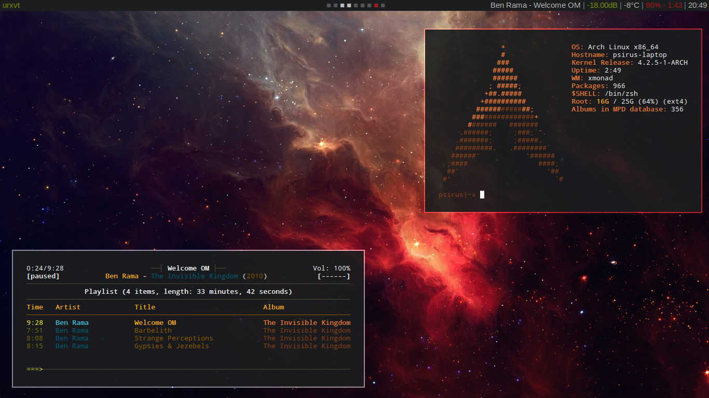

Psirus' Dot Files
=================

This my collection of config files, used to set up my system to my liking and
increase my productivity (if only). Additionally, I can reference to it if
someone asks, and I'll be able to track the *progress* of these things.

I will continue to pick & choose bits from all over the internet whenever I
come across something I think is interesting.

Installation
------------

Should be relatively painless::

    git clone https://github.com/Psirus/dotfiles.git ~/.dotfiles
    cd .dotfiles && ./init.sh

The `init.sh` script will use Stow to link the dotifles into your home
directory, and try to setup vundle for vim.

Setup
-----

- Xmonad with BinarySpaceLayou
- dzen2 with custom skype indicator
- One set of dotfiles for desktop and notebook

Screenshot
----------

Feedback
--------

Tell me what you think or whether you have any problems with my configs:
https://github.com/Psirus/dotfiles/issues
